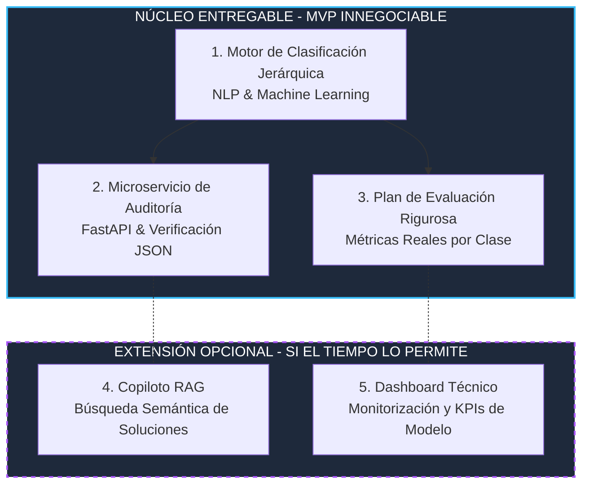

# SITOR — Sistema Inteligente de Tipificación, Orquestación y Resolución de Incidencias

> **Proyecto de Fin de Máster (PFM)**  
> **Máster en Data Science & IA** — *Evolve Academy*  
> **Versión del Alcance:** v2 (Enfoque en MVP modular y riguroso)

---

## 📌 1. Descripción y Contexto del Proyecto

En el sector de *Business Process Outsourcing* (BPO) y en las operaciones de soporte de las grandes compañías de telecomunicaciones, la correcta clasificación inicial de las incidencias en el Front Office (Nivel 1) es crítica. Los agentes operan bajo estrictas métricas de **Tiempo Medio de Operación (TMO)**, lo que, sumado a la ambigüedad del lenguaje en el texto libre del cliente, genera errores frecuentes al asignar la **"tripleta" del CRM** (*Tipo / Subtipo / Detalle* o departamento/cola de destino).

Un error en esta asignación provoca un **falso escalado** hacia el Back Office (Nivel 2) o al departamento equivocado. Esto consume recursos técnicos costosos en investigar, reasignar y devolver el ticket a la cola correcta, disparando el **Tiempo Medio de Resolución (AHT)** y reduciendo la satisfacción del cliente.

**SITOR** nace para resolver este problema mediante la combinación de **Procesamiento de Lenguaje Natural (NLP)** y **Arquitecturas MLOps/RAG**. El sistema actúa como un **auditor inteligente e interceptor en tiempo real**: analiza el texto del ticket y la tipificación seleccionada por el CRM para verificar si la asignación es correcta o, en caso de discrepancia, recomendar la tipificación adecuada antes de que el ticket sea enrutado erróneamente.

---

## 🎯 2. Alcance Modular: Núcleo Entregable y Extensión

Para garantizar la máxima solvencia técnica, rigor académico y viabilidad de ejecución en el calendario del TFM, el proyecto adopta una estructura modular estrictamente priorizada en dos niveles:



---

## 💎 3. Núcleo Entregable (MVP Innegociable)

El **Núcleo Entregable** constituye el corazón funcional y defendible del TFM. Es el compromiso innegociable cuyo rendimiento se valida con métricas cuantitativas reales sobre un dataset de partida concreto.

### 3.1. Motor NLP y Clasificación Jerárquica de Tripletas
* **Dataset de Partida:** Trabajo sobre el conjunto público *Multilingual Customer Support Tickets* (Kaggle, T. Bueck). Se extrae y filtra la muestra en español enfocada en categorías afines a soporte técnico (`Technical Support`, `IT Support`, `Product Support`), combinando los atributos `queue + type + priority` como proxy realista de la tripleta (*Tipo / Subtipo / Detalle*) de un CRM de telecomunicaciones.
* **Preprocesado y Normalización:** Limpieza de texto, tokenización con `spaCy`, anonimización básica de PII y gestión de abreviaturas del sector de telecomunicaciones (ej. *ONT, router, APN, IMEI, pérdida de paquetes* mediante diccionario especializado).
* **Vectorización y Modelado:**
  * **Baseline:** Representación `TF-IDF` acoplada a modelos de clasificación en conjunto (`XGBoost` / `Random Forest` / `Logistic Regression`).
  * **Evolución:** Uso de **Embeddings semánticos** densos (`sentence-transformers`) para capturar matices e intenciones implícitas en el texto del cliente.
* **Gestión del Desequilibrio de Clases:** Aplicación de pesos de clase (`class_weight`) y técnicas de remuestreo (ej. `SMOTE` en el espacio vectorial) para garantizar el aprendizaje en tipificaciones minoritarias críticas.
* **Calibración del Umbral de Confianza Operativa:** El modelo no asigna tipificaciones automáticamente a ciegas. Se calibra empíricamente un umbral mínimo de probabilidad: si la certeza de la predicción es inferior a este umbral, el caso se enruta a **revisión manual**, optimizando el balance precisión-cobertura.

### 3.2. Microservicio API de Auditoría con FastAPI
El motor de clasificación se expone como un servicio web asíncrono y desacoplado, diseñado para integrarse con CRMs externos vía *webhook* o peticiones REST:
* **Contrato e Interfaz de Verificación:** La API recibe en formato JSON el **texto del ticket** y la **tripleta asignada por el agente en el CRM**.
* **Lógica de Auditoría en Tiempo Real:** El microservicio contrasta la tripleta recibida con la predicción interna del motor NLP:
  * ✅ **Coincidencia (`Correcta`):** Se valida el enrutamiento y se permite el paso a la cola destino.
  * ⚠️ **Discrepancia (`Incorrecta`):** Se intercepta el potencial falso escalado, devolviendo una alerta de auditoría junto con la tripleta predicha como **corrección sugerida**.
* **Estándares y Documentación:** Endpoints asíncronos (`async def`) de alta concurrencia servidos con `Uvicorn` y validados por esquemas estrictos de `Pydantic`. Documentación interactiva autogenerada disponible vía **OpenAPI (`/docs`)**.

### 3.3. Plan de Evaluación y Rigor Cuantitativo
La validación del MVP se fundamenta en un marco metodológico estricto:
1. **Splits Estratificados:** Partición rigurosa en conjuntos de entrenamiento, validación y prueba (`Train / Val / Test`) manteniendo la proporción original de las clases.
2. **Métricas Granulares:** Evaluación detallada por clase cuantitativa (`Precisión`, `Recall`, `F1-Score` y `Macro-F1`), prestando especial atención al comportamiento en clases minoritarias propensas al misrouting.
3. **Comparativa y Ablación:** Análisis comparativo documentado entre el modelo *Baseline (TF-IDF)* y la arquitectura avanzada con *Embeddings*, justificando empíricamente la selección final.
4. **Análisis de Matriz de Confusión vs. Negocio:** Identificación sistemática de los pares de categorías con mayor confusión mutua y evaluación de su impacto operativo (no todos los errores de tipificación tienen el mismo coste de recontacto o retrabajo).

---

## ⚡ 4. Extensión Opcional (Desarrollo Sujeto a Disponibilidad de Tiempo)

Una vez completado, validado y cerrado el **Núcleo Entregable (MVP)**, y **únicamente si el calendario del máster lo permite**, el proyecto contempla las siguientes extensiones técnicas para potenciar la solución:

### 4.1. Copiloto RAG para Asistencia y Resolución contextual
* **Indexación Vectorial:** Creación de una base de conocimiento en `ChromaDB` indexando el histórico de resoluciones efectivas y notas técnicas de los agentes (presentes en el dataset de partida).
* **Recuperación Semántica (Retrieval):** Ante la llegada de un ticket correctamente tipificado, el sistema realiza una búsqueda vectorial de los $N$ casos anteriores más concordantes semánticamente.
* **Síntesis Generativa (Generation):** Integración con un LLM (`OpenAI API` o modelo open-source ejecutado localmente mediante `Ollama`) que toma el texto del ticket actual y las resoluciones recuperadas para redactar una **propuesta de respuesta o pasos de resolución asistida** para el técnico del Back Office.

### 4.2. Dashboard Técnico y Monitorización del Modelo
* **Interfaz Visual de Análisis (`Pandas / Matplotlib / Plotly`):** Construcción de una interfaz o cuadro de mando técnico que permita visualizar en tiempo real o en batch:
  * Evolución de las métricas F1 y matrices de confusión por cola.
  * Distribución del nivel de confianza operativa (porcentaje de casos autovalidados vs. derivados a revisión humana).
  * Tiempos de latencia de inferencia del microservicio FastAPI.

---

## 🛠️ 5. Stack Tecnológico

| Área | Tecnología / Herramienta | Uso Principal |
| :--- | :--- | :--- |
| **Lenguaje Core** | Python 3.10+ | Desarrollo del pipeline NLP, modelado y microservicios |
| **Preprocesado & NLP** | `spaCy`, `NLTK`, `re` | Tokenización, lematización, normalización de texto y PII |
| **Representación Vectorial** | `scikit-learn` (TF-IDF), `sentence-transformers` | Embeddings semánticos y vectorización dispersa |
| **Machine Learning** | `scikit-learn`, `XGBoost` | Entrenamiento del clasificador jerárquico y ajuste de umbrales |
| **Backend & API REST** | `FastAPI`, `Pydantic`, `Uvicorn` | Microservicio asíncrono de auditoría y esquemas de validación |
| **RAG / Vector Store (Extensión)** | `LangChain`, `ChromaDB`, `OpenAI API` / `Ollama` | Búsqueda semántica e indexación de resoluciones previas |
| **Evaluación & Visualización** | `Pandas`, `NumPy`, `Matplotlib`, `Plotly` | Tratamiento de datos, métricas de test y gráficas de evaluación |

---

## 📂 6. Estructura del Repositorio

```text
SITOR/
├── data/
│   ├── raw/                 # Dataset base (Multilingual Customer Support Tickets)
│   └── processed/           # Datos limpios, normalizados y divididos (Train/Val/Test)
├── docs/
│   ├── Propuesta_PFM_SITOR_v3.md   # Documento de alcance y fundamentación v3
│   └── prompt_gem_sitor_v2.md      # Guía y configuración del mentor de PFM v2
├── notebook/
│   └──                      # Notebooks exploratorios (EDA, comparativas de modelos, calibración)
├── src/
│   └──                      # Código fuente modular (preprocesado, entrenamiento, API FastAPI)
├── .gitignore               # Configuración de exclusión de binarios, venv y secretos
├── LICENSE                  # Licencia del proyecto
├── README.md                # Documentación principal del proyecto (este archivo)
└── README                   # Espejo de documentación principal
```

---

## 🚀 7. Guía de Inicio Rápido *(Próximamente)*

> *A medida que se desarrollen los módulos en la carpeta `src/`, aquí se incluirán los comandos exactos para la configuración del entorno virtual (`.venv`), la instalación de dependencias (`requirements.txt`), el entrenamiento de los clasificadores y la ejecución local del servidor `FastAPI` vía `Uvicorn`.*

---
*Autoría: Proyecto individual desarrollado para la defensa del Máster en Data Science & IA de Evolve Academy.*
