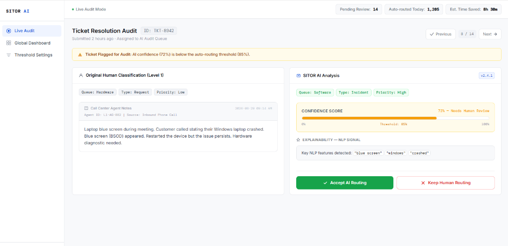

# 05 - Diseño del Frontal y Experiencia de Usuario

## 1. Resumen de la solución y del usuario
* **Qué problema resuelve:** Los falsos escalados derivados de una mala tipificación inicial de tickets por parte de los agentes de Nivel 1 en *Call Centers* (BPO), lo que encarece severamente los costes operativos.
* **Quién es el usuario principal:** El Coordinador de Soporte o Auditor de Calidad (Nivel 2).
* **Necesidad o tarea concreta:** Revisar y auditar de forma ágil aquellos tickets donde el algoritmo de IA no alcanza la confianza matemática suficiente para realizar un auto-enrutamiento opaco.
* **Tipo de producto diseñado:** Herramienta Operativa de Auditoría y Clasificación (*Human-in-the-loop*).
* **Acción principal obtenida:** Validar la sugerencia de enrutamiento de la IA o mantener la clasificación humana original mediante un solo clic.

## 2. Imagen mockup del frontal
*(Nota conceptual: Este diseño es un prototipo visual provisional para ilustrar la interacción operativa entre la lógica del backend algorítmico y la toma de decisiones humana).*

## 3. Justificación del diseño

### 3.1. Utilidad y valor de la solución
El frontal resuelve el problema clásico de la "caja negra" en la Inteligencia Artificial. En un entorno corporativo, no basta con predecir; el auditor necesita contexto rápido. La interfaz reduce radicalmente la carga cognitiva: en lugar de leer el ticket y navegar por un árbol de decisión mental de múltiples clases combinadas, el auditor recibe la sugerencia pre-procesada. Esto ahorra minutos por ticket, mitigando el riesgo de falso escalado y convirtiendo un resultado probabilístico puro en una acción operativa inmediata (`Accept AI Routing`).

### 3.2. Flujo de usuario
1. **Punto de entrada:** El usuario accede a la vista "Live Audit". Solo ve los tickets que el backend ha flagelado para revisión (Probabilidad entre 60% y 84.99%).
2. **Entradas o selecciones:** No necesita introducir texto. Su entrada es la revisión visual de la columna izquierda (origen humano) frente a la columna derecha (análisis algorítmico).
3. **Procesamiento (Backend invisible):** La API ya ha ejecutado el pipeline NLP (vectorización TF-IDF) y la inferencia del *Random Forest* para obtener la Tripleta predictiva y su distribución paramétrica.
4. **Resultado:** Recibe la clase ganadora y un *Confidence Score* numérico, acompañado de las variables que dispararon la decisión matemática.
5. **Acción:** Pulsa el botón primario (verde) para sobreescribir la clasificación en el CRM, o el secundario (rojo) para ignorar a la IA.

### 3.3. Experiencia de usuario (UX)
He diseñado la interfaz bajo los principios de mínima fricción visual:
* **Jerarquía estructural:** La vista se bifurca en un diseño A/B (Izquierda = Humano, Derecha = Máquina). La atención es capturada de inmediato por la alerta superior y la barra de progreso de confianza.
* **Simplicidad:** He descartado deliberadamente incluir gráficas temporales o dashboards complejos en esta vista activa. La interfaz es puramente resolutiva y no distrae de la tarea de auditoría.
* **Contexto y confianza:** Se fomenta la adopción de la herramienta al no ocultar la incertidumbre. Mostrar explícitamente que la IA tiene solo un "72%" de seguridad invita al humano a colaborar, eliminando el rechazo habitual del operario hacia los sistemas automatizados cerrados.

## 4. Presentación de resultados y explicabilidad
El resultado principal (la predicción categórica multiclase) se acompaña obligatoriamente de métricas de interpretabilidad para evitar que el usuario reciba una estimación como una certeza infalible:
* **El contexto del resultado:** La etiqueta predicha se presenta bajo un componente de "*Confidence Score*" con una barra de progreso que mapea la predicción contra el umbral crítico de auto-enrutamiento (85%).
* **Renuncia expresa a la IA Generativa:** **No se aplicará IA Generativa en este proyecto.** En entornos de soporte técnico IT y BPO corporativo, el riesgo de "alucinaciones" de un LLM introduce una latencia y un riesgo legal/operativo inasumibles. La explicabilidad (*Explainability*) de SITOR se extrae de forma puramente determinista y estadística desde el modelo *Random Forest* y la matriz TF-IDF, aislando y mostrando las palabras exactas (features) con mayor peso en el corte del nodo de decisión (Ej: *"blue screen"*, *"windows"*).

## 5. Alcance del MVP
Este diseño es una representación visual ambiciosa orientada a la visión final del producto. Para el alcance estricto evaluable de este TFM (MVP), el esfuerzo técnico se centrará casi exclusivamente en el desarrollo del núcleo algorítmico predictivo y su empaquetado como microservicio mediante **FastAPI**. 

El frontal aquí expuesto es un prototipo conceptual para anclar el caso de uso del negocio. Si el calendario de la entrega final lo permite, se desarrollará una versión funcional hiper-simplificada mediante la librería *Streamlit* puramente para poder interactuar en vivo con la API durante la defensa pública; sin embargo, cualquier elemento adicional de navegación (como el "Global Dashboard" o "Threshold Settings") queda explícitamente fuera del alcance de desarrollo del MVP y se documenta como trabajo de ingeniería futura.
